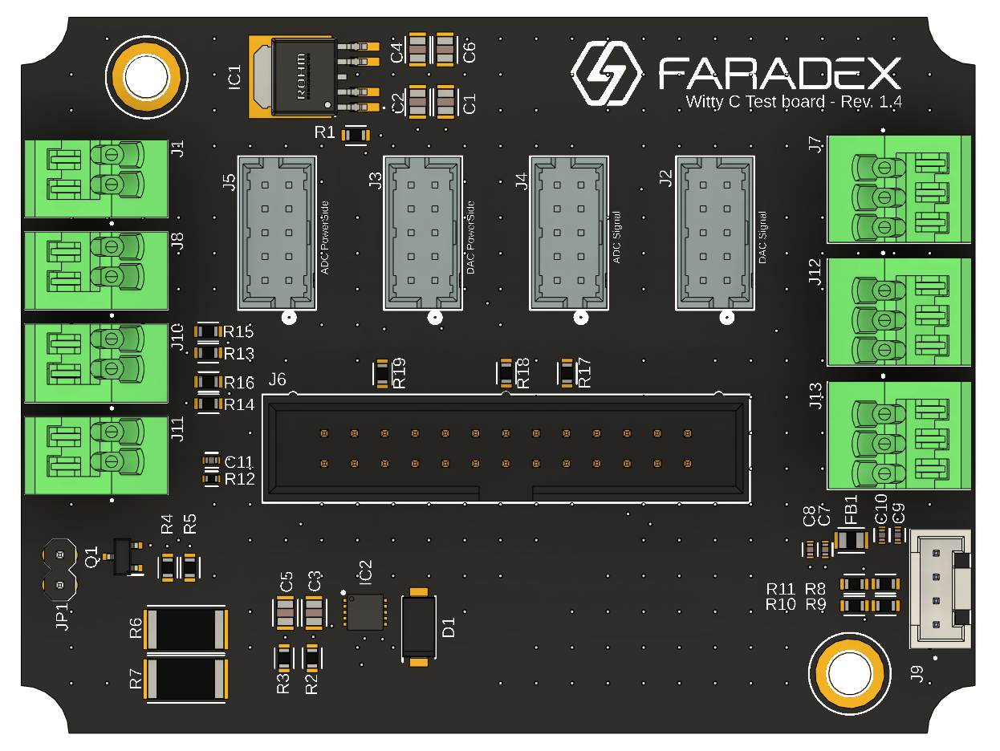

# WittyC Hardware Test Suite

A comprehensive test suite for WittyC board validation using Raspberry Pi 4B and Waveshare peripherals.

## Hardware Requirements

- Raspberry Pi 4B
- [Waveshare RS485 CAN HAT (B)](https://www.waveshare.com/product/rs485-can-hat-b.htm)
- [Waveshare Modbus RTU 8CH Analog Output (B)](https://www.waveshare.com/modbus-rtu-analog-output-8ch.htm)
- [Waveshare Modbus RTU 8CH Analog Input (B)](https://www.waveshare.com/modbus-rtu-analog-input-8ch.htm)
- WittyC board rev 1.4
  

## Project Structure

### Main Scripts

- `hardware_control_singleBus.py`: Core classes for RS485 device interaction
  - `RS485Device`: Base class for RS485 communication
  - `AnalogOutput`: DAC control interface
  - `AnalogInput`: ADC reading interface

- `testRoutine.py`: Primary test execution script that validates hardware specifications

- `lib/`: Contains RS485 CAN HAT support libraries

## Test Specifications

### 1. Temperature Test (TP_1 on WittyC HW, B8 schematic)
- Validates temperature sensor (ERT-J1VG103JA)
- Uses Beta parameter for voltage-to-temperature conversion
- Verifies ambient temperature (~25°C)

### 2. Voltage Sense Test (TP_2 on WittyC HW, B7 schematic)
- **Step 2.1**: DAC_1 activation → ADC_2 voltage verification
- **Step 2.2**: DAC_1 + DAC_3 activation → ADC_2 voltage verification
- **Step 2.3**: Over-voltage protection verification (DAC_1 off → ADC_2 = 0V)

### 3. Over-Current Protection Test
- Activates DAC_1 and DAC_2
- Monitors current sense (CUR_S) at TP_3 (~1A)
- Validates protection by deactivating DAC_2

### 4. 3.3V Test
- DAC_1 activation → TP_13 (ADC_7) voltage verification (3.3V)

### 5. CC Test
- **CC1, CC2 On State**: DAC_4/DAC_5 → 3.3V, verify ADC_4/ADC_5
- **CC1, CC2 Off State**: DAC_4/DAC_5 → 0.5V, verify ADC_4/ADC_5 = 0V

### 6. User Button Test
- Validates TP_9_FUNC_BTN (ADC_6) state

## Setup Instructions

1. Clone repository to Raspberry Pi
2. Install dependencies:
```bash
pip install RPi.GPIO pyserial
```

## Usage

1. Activate virtual environment:
```bash
source rs485_env/bin/activate
```

2. Execute test suite:
```bash
sudo python testRoutine.py
```

## Sample Output
```
INFO:root:Initializing RS485 devices...
INFO:root:Starting Temp Test
INFO:root:Temperature: 25.00°C
INFO:root:Temp Test Passed
INFO:root:Starting Voltage Sense Test
INFO:root:Setting output voltage to 5.0V on DAC channel 1
INFO:root:Voltage Sense (Step 2.1): 5.00V
INFO:root:Setting output voltage to 5.0V on DAC channel 3
INFO:root:Voltage Sense (Step 2.2): 5.00V
INFO:root:Setting output voltage to 0.0V on DAC channel 1
INFO:root:Voltage Sense (Step 2.3): 0.00V
INFO:root:OVProtection Test Passed
```

## License

MIT License (See LICENSE file for details)

## Acknowledgments

- Waveshare support team for RS485 CAN HAT documentation
- WittyC hardware team for technical specifications and support
